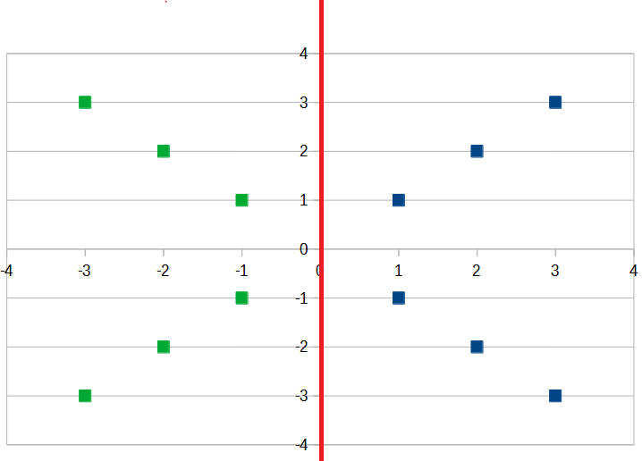
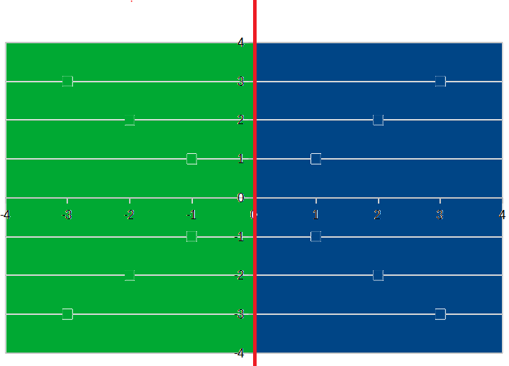
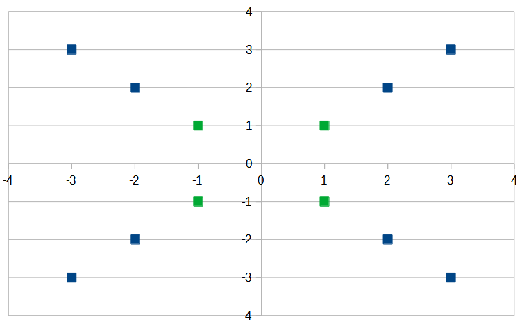
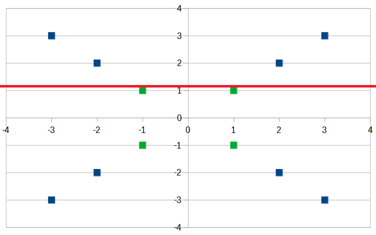
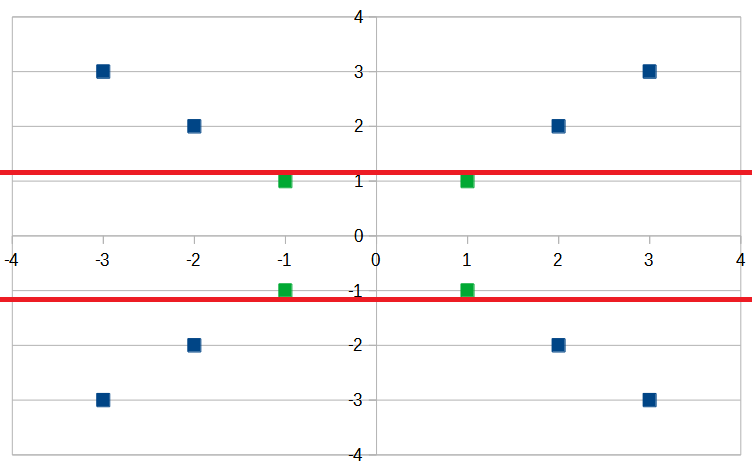
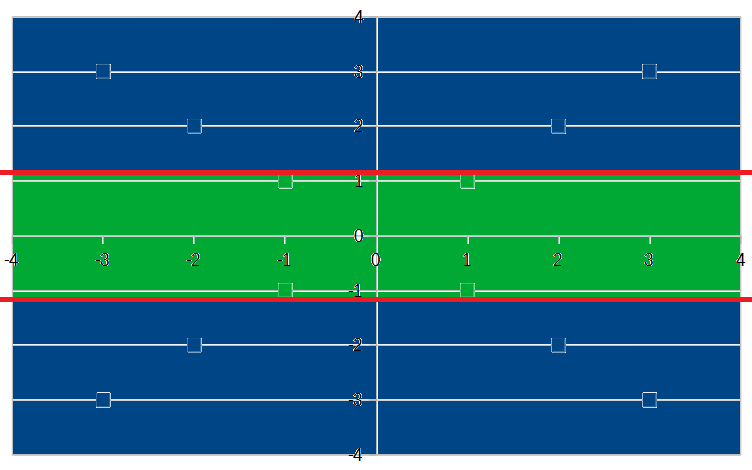

## Steps:

1. Get data
2. Clean data
3. Partition data (into training/test sets)
4. Create an ML model using SciKit Learn...
5. Train the model
6. Make predictions with the model
7. Evaluate and improve

## Tools:

Numpy (multi-dimensional arrays very fast)
Pandas (dataframe structures)
MatPlotLib (plotting)
Scikit-learn (ML models)
Jupyter Lab/Jupyter Notebook

## Data Source:
Scraped from https://projects.fivethirtyeight.com/biden-approval-rating/

#### How a Decision Tree Classifier Works

A decision tree classifier is a binary tree structure, 
which divides a labeled dataset at each node so as to
maximize information gain.

###### Example 1:
Consider a 2D labeled dataset, where each row is a data point:

| x   | y   | label |
|-----|-----|-------|
| 1   | 1   | blue  |
| 2   | 2   | blue  |
| 3   | 3   | blue  |
| -1  | -1  | blue  |
| -2  | -2  | blue  |
| -3  | -3  | blue  |
| 1   | -1  | green |
| 2   | -2  | green |
| 3   | -3  | green |
| -1  | 1   | green |
| -2  | 2   | green |
| -3  | 3   | green |

We could imagine plotting the points on a graph:

On this graph, it's easy to find the line which divides this dataset into the two most "pure" sets of labels:

To make predictions about the label of a hypothetical data point, 
we can extrapolate its label based on which side of the line it lands on:

So, for instance, a point at -2, -3 would receive the label "green." 
Similarly, a point at 1, 2 would receive the label "blue."

###### Example 2:

Imagine a different dataset, whose plot looks like this:

It's not possible to divide this dataset into groups of pure labels with just a single line. 
The best we can do with one line is something like this:

In this example, we have two nodes eminating from the first decision.
We can see that one of these nodes (represented by the space above the red line) is "pure."
The other of our two nodes, below the red  line, is "impure," containing an equal number of green and blue labels. 
While we can say with a relatively high degree of confidence 
that anything hypothetical point above the red line should be labeled "blue," 
it's not yet clear how we should deal with hypothetical points below the line. 
To answer this question, we will have to keep adding lines until we have pure partitions. 
It turns out, we only need one more line to satisfy this objective:

And our pure partitions look like this:

