## Steps:

1. Get data
2. Clean data
3. Partition data (into training/test sets)
4. Create an ML model using SciKit Learn...
5. Train the model
6. Make predictions with the model
7. Evaluate and improve

## Tools:

Numpy (multi-dimensional arrays very fast)
Pandas (dataframe structures)
MatPlotLib (plotting)
Scikit-learn (ML models)
Jupyter Lab/Jupyter Notebook

## Data Source:
Scraped from https://projects.fivethirtyeight.com/biden-approval-rating/

## How a Decision Tree Classifier Works:

A decision tree classifier is a binary tree structure, 
which divides a labeled dataset at each node, 
to maximize information gain at each point of division. 
It is a "greedy" algorithm.

###### Example 1:
Consider a 2D labeled dataset, where each row is an observation:

| x   | y   | label |
|-----|-----|-------|
| 1   | 1   | blue  |
| 2   | 2   | blue  |
| 3   | 3   | blue  |
| -1  | -1  | blue  |
| -2  | -2  | blue  |
| -3  | -3  | blue  |
| 1   | -1  | green |
| 2   | -2  | green |
| 3   | -3  | green |
| -1  | 1   | green |
| -2  | 2   | green |
| -3  | 3   | green |

We could imagine plotting the points on a graph:
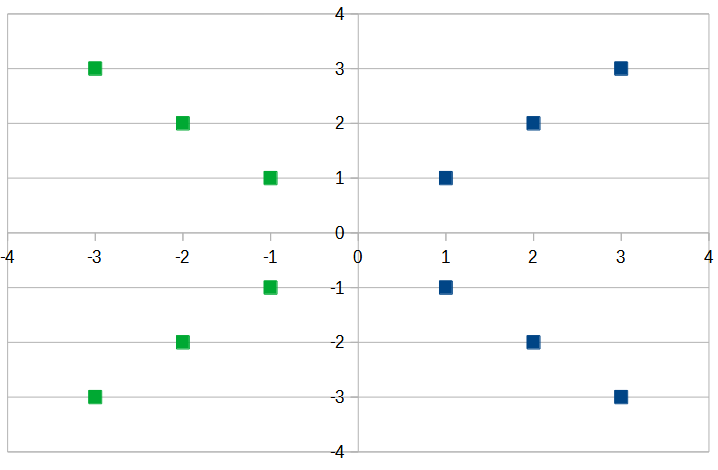

On this graph, it's easy to find the line which divides this dataset into the two most "pure" sets of labels:
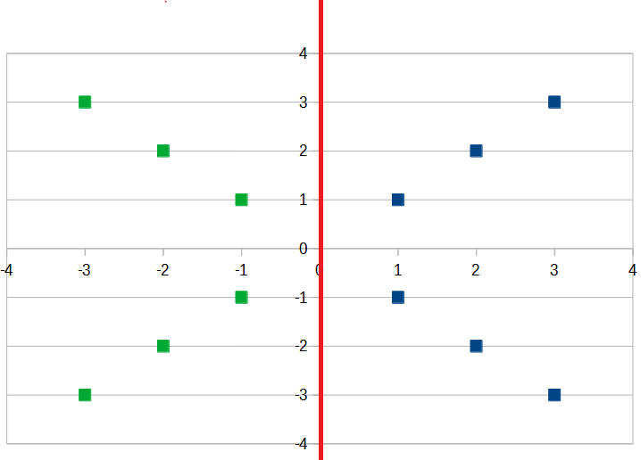

To make predictions about the label of a hypothetical data point, 
we can extrapolate its label based on which side of the line it lands on:
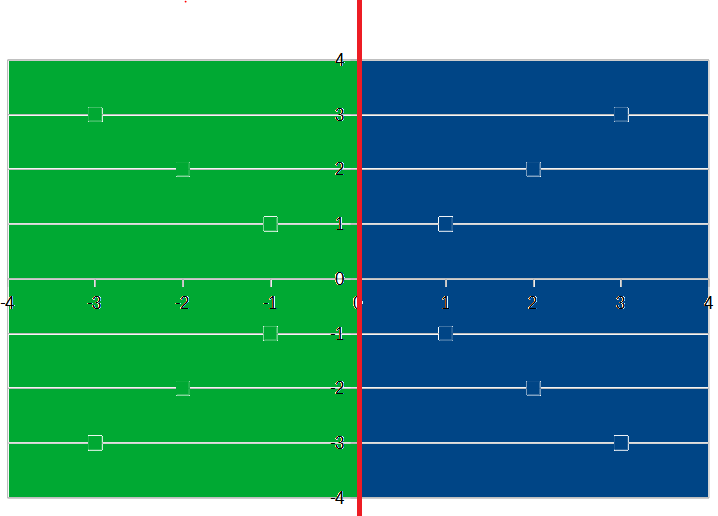

So, for instance, a point at -2, -3 would receive the label "green." 
Similarly, a point at 1, 2 would receive the label "blue."

###### Example 2:

Imagine a different dataset, whose plot looks like this:
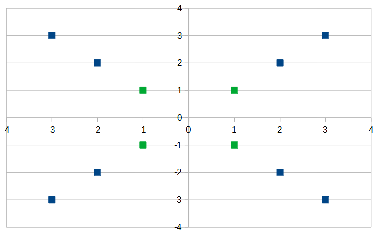

It's not possible to divide this dataset into groups of pure labels with just a single line. 
The best we can do with one line is something like this:
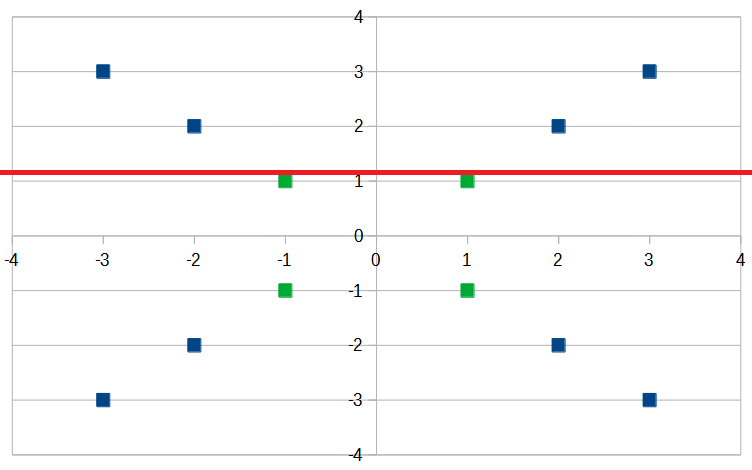

In this example, we have two nodes eminating from the first decision.
We can see that one of these nodes (represented by the space above the red line) is "pure."
The other of our two nodes, below the red  line, is "impure," containing an equal number of green and blue labels. 
While we can say with a relatively high degree of confidence 
that any hypothetical point above the red line should be labeled "blue," 
it's not yet clear how we should deal with hypothetical points below the line. 
To answer this question, we will have to keep adding lines until we have pure partitions. 
It turns out, we only need one more line to satisfy this objective:
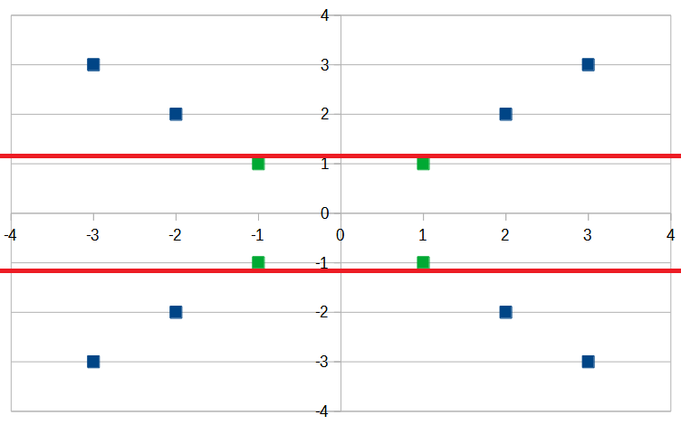

And our pure partitions look like this:
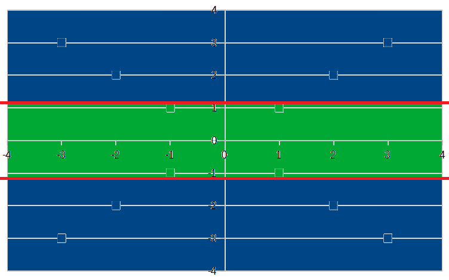

You may notice that there are multiple ways to optimally classify this data. 
Here's another example, which would provide different predictions in some cases: 
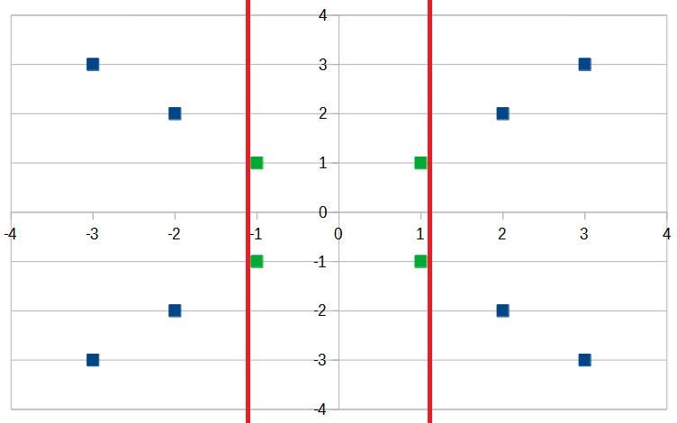
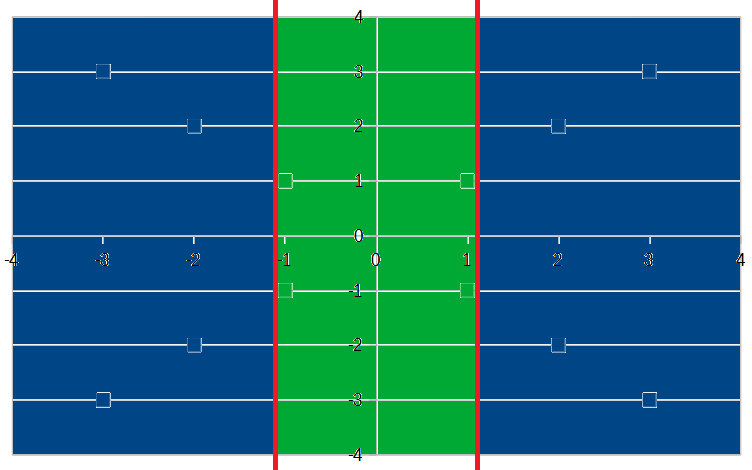

So, we could say that this dataset does not really provide enough information to disambiguate between these two options. 
We would probably be best off if we collected more observations for our data before making a prediction.

A third possibility looks like this:
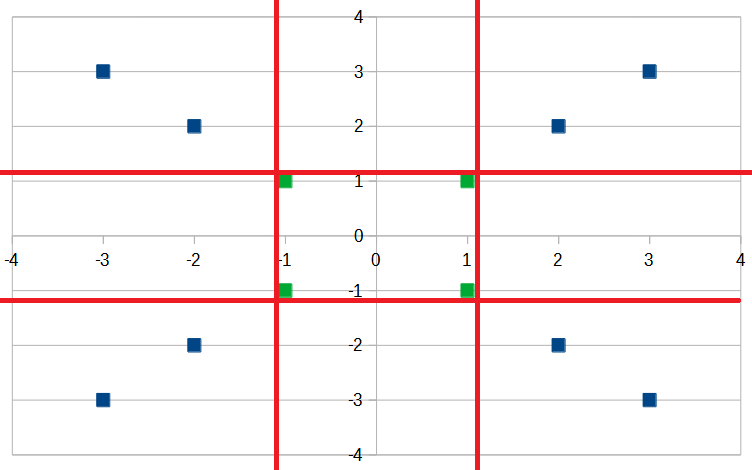
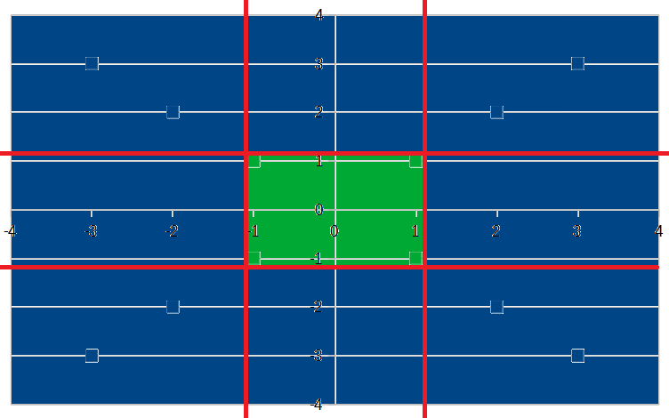

One could argue that the above example is a case of "overfitting" our model to our data, 
which implies that the data does not necessarily justify the number of decisions made (four instead of two).
Ultimately, that is a judgement call for an informed data scientist to make.

###### Example 3:

Imagine the case where we have this dataset. 
It's similar to the previous example, but with two additional observations at (1.5, 2.5) and (1.25, -1.5):
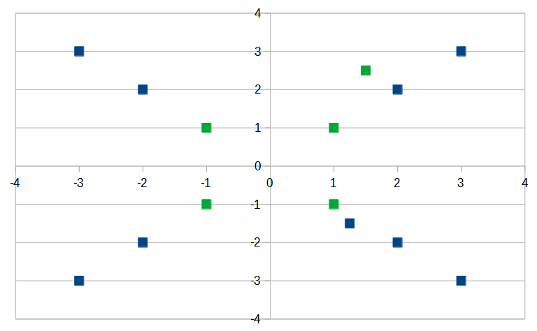

In this example, there is just one location where we can draw a first line of separation 
to produce the maximal amount of information gain:
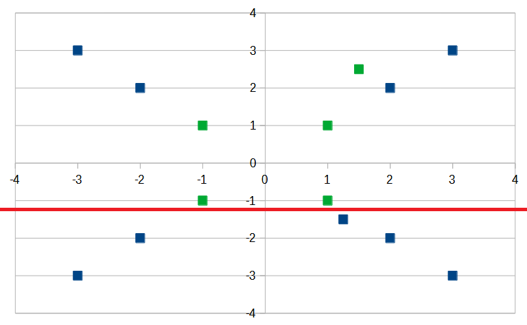

After drawing this line, you can see that we have one pure node with five observations, 
which is the largest pure node possible with a single line.

For the second line of separation, we have two options which each produce an equal, optimal amount of information gain. 
From left to right, they are:
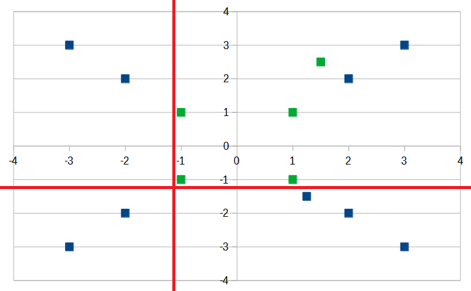
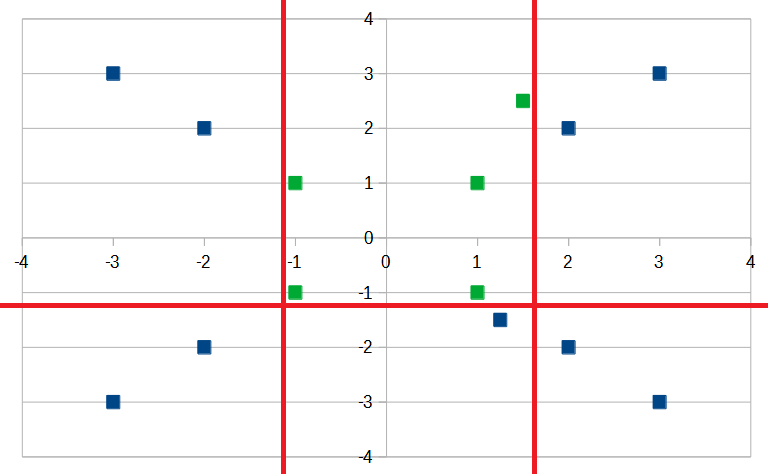

With these three lines of separation, we have produced pure groups of labels, and so our model looks like this:
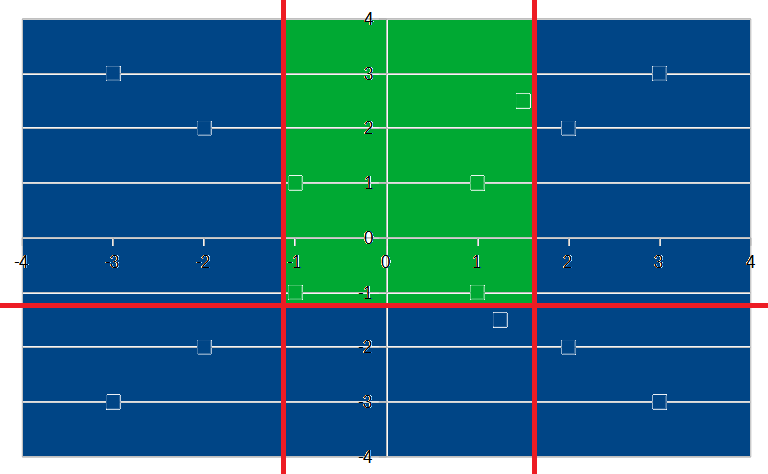
